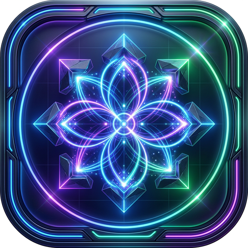

# Gocurvicnamics

Gocurvicnamics is an asynchronous, kinetic trajectory-based strategy game built using a dual-layer architecture. It leverages a blazing-fast Rust backend for continuous physics resolution and a modern, glassmorphic Vanilla JS frontend via Tauri v2 for rendering and input handling.




## Core Gameplay Mechanics

### 1. Symmetric Squared Board Topology
The board is dynamically generated as a single $N \times N$ squared matrix of grids, tailored by the user's `Layout` setting.
- **Symmetry**: The board is divided symmetrically. The left-side grids belong to Player 1, and the right-side grids belong to Player 2.
- **Neutral Zones**: If an odd $N \times N$ layout is chosen (e.g., $3 \times 3$), the exact center column of grids acts as a neutral "void" zone where no pieces can be initially placed.
- **Void Padding**: Grids are separated by a customizable "Empty Space" value, expanding the total kinetic boundaries.

### 2. Infinite Kinetic Movement
Unlike traditional turn-based games, physics in Gocurvicnamics is continuous and perfectly frictionless.
- **Perfect Elasticity**: All unit pieces and walls possess a restitution of `1.0` and damping of `0.0`.
- **Infinite Bouncing**: Once an initial trajectory impulse is applied to a piece, it will bounce endlessly around the board, conserving all its momentum.
- **Continuous Turns**: Turns pass immediately after a trajectory is drawn and executed. Players must trace trajectories amidst a constantly moving, chaotic battlefield.

### 3. Adversary-Only Collisions & Scoring
Unit pieces only take damage under specific collision circumstances.
- **Friendly Fire Disabled**: Pieces belonging to the same player will bounce off each other perfectly without sustaining damage.
- **Adversary Damage**: Collisions between units belonging to opposing players will drain `-1 HP` per physical tick per collision from both units.
- **Disintegration & Scoring**: When an adversary unit is whittled down to `0 HP`, it disintegrates from the board. The opposing player is immediately awarded `100 points`.

## Stones (Units)

Gocurvicnamics features distinct unit types, each characterized by unique kinetic and physical properties.

### Current Stones
- **Base (Standard)**: The workhorse of your fleet. Features standard mass (`1.0`) and balanced health. Reliable for both offensive strikes and defensive bouncing.
- **Dampener**: A heavyweight unit with high mass (`2.0`). Because of its sheer inertia, it moves slower but effortlessly shoves lighter stones out of its way upon impact. Ideal for protecting critical zones or disrupting enemy clusters.
- **Slingshot**: A lightweight, highly kinetic unit with low mass (`0.5`). Accelerates rapidly and ricochets at extreme velocities, making it perfect for chaotic, unpredictable strikes, though it is often more fragile.
- **Amplifier**: A support-oriented stone. Conceptually designed to amplify the kinetic energy or trace-speed of friendly units passing nearby.

### Hypothesized Future Stones
- **Pulsar Stone**: Emits radial kinetic shockwaves at set intervals. These shockwaves push away all nearby stones without requiring direct collision, creating localized zones of repulsion.
- **Siphon (Vampire) Stone**: Recovers a fraction of its HP whenever it successfully deals collision damage to an adversary unit, rewarding aggressive, high-impact trajectories.
- **Quantum Tether Stone**: Can be linked to another friendly stone. The two stones share a single HP pool and exert a physical pulling force toward each other, acting as a massive, sweeping kinetic bola as they bounce around the board.
- **Phalanx Stone**: Features directional kinetic armor. Takes zero damage if struck from the front hemisphere (relative to its velocity vector) but suffers double damage if flanked from behind.
- **Graviton Stone**: Possesses a dense gravitational pull. Subtly alters the trajectories of nearby adversary stones, dragging them into its path to force inevitable collisions.

## Development & Technology Stack

- **Tauri v2**: Acts as the inter-process communication bridge.
- **Rust + Rapier2D**: Handles the continuous $60\text{Hz}$ narrow-phase physics simulation. Ownership data (Player ID and HP) is bit-packed into the Rapier Collider's `user_data` (`u128`) for instantaneous damage resolution.
- **Vite + Vanilla JS**: Handles DOM Overlays (glassmorphism), Canvas rendering, bezier-curve chaining (`bezier-js`), and the Game State Machine (`TurnManager`).

## Installation

```bash
# Install frontend dependencies
pnpm install

# Run the Tauri application (Frontend + Rust Backend)
pnpm run tauri dev
```
