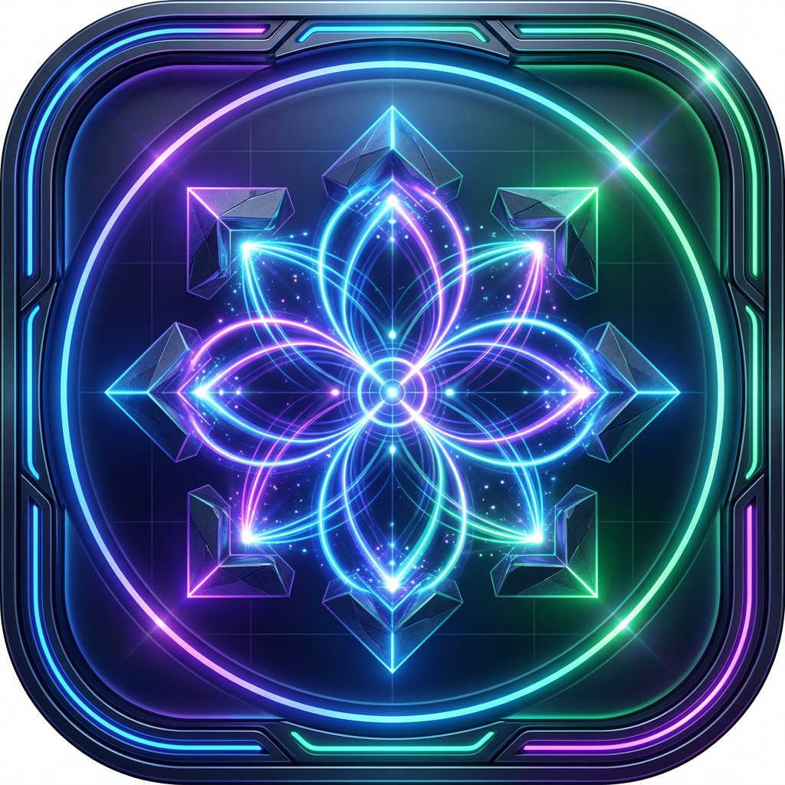
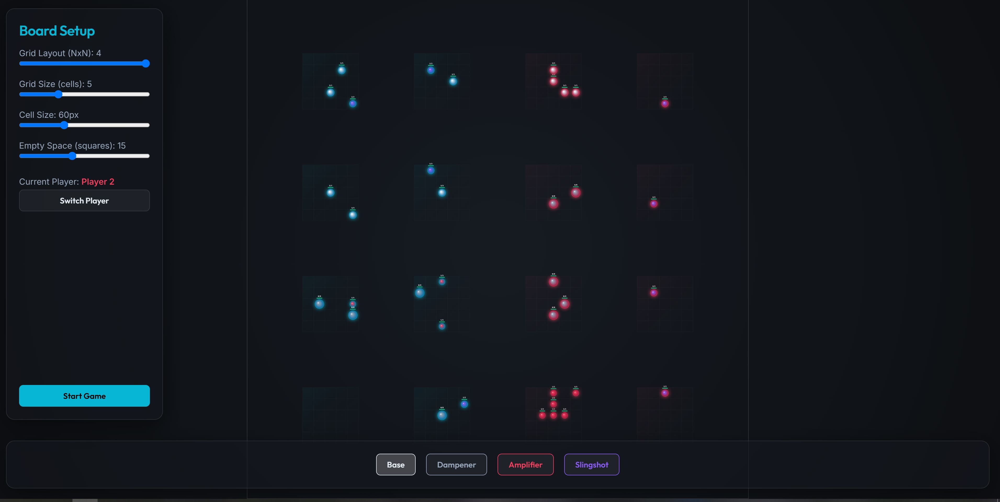

# Gocurvicnamics

Asynchronous kinetic trajectory strategy — dual-engine physics (Matter.js / Rapier2D), atomic modular architecture, and AI-powered post-game reflection synthesis.

Two players take turns drawing cubic bezier trajectories on a frictionless board. Once launched, a piece bounces perpetually with zero energy loss, colliding with walls and enemy pieces until its HP is depleted. The last player with a surviving piece wins.

## Logo



## UI



---

## Core Gameplay

### Board Topology

```
┌─────────────────────────────────────────────────┐
│  ┌──────┐          VOID          ┌──────┐       │
│  │ P1   │      EXPANSE           │ P2   │       │
│  │ Zone │   (transit space)      │ Zone │       │
│  │ 2×2  │                        │ 2×2  │       │
│  │      │                        │      │       │
│  └──────┘                        └──────┘       │
│< ---------------- 1400px ------------------- >   │
└─────────────────────────────────────────────────┘
```

- **1400×800px** canvas, **50px** wall thickness, **5×5** logical grid
- **60px** cell size, **15px** empty space between cells
- Player 1 occupies the 2 left anchor zones; Player 2 the 2 right zones
- Center column is **Void Expanse** — transit space with no placement
- Wall boundaries are static with **restitution 1.0** — perfect elastic bounce

### Turn Cycle

1. **SELECT_PIECE** — click one of your pieces on the board
2. **DRAW_TRACE** — click 3 points per segment (CP1 → CP2 → Endpoint), Enter to confirm, Esc to cancel
3. **ANIMATING_TRACE** — piece glides along the drawn bezier curve
4. **PHYSICS_RESOLVE** — piece inherits the curve's end-vector momentum, bounces forever until destroyed
5. **END_TURN** — switches to the other player

### Perpetual Motion

| Parameter | Value | Effect |
|-----------|-------|--------|
| `linearDamping` | 0.0 | No velocity decay |
| `angularDamping` | 0.0 | No rotational slowdown |
| `frictionAir` (Matter.js) | 0.0 | No air resistance |
| `friction` | 0.0 | No surface friction |
| `restitution` | 1.0 | Perfectly elastic bounces |

A launched piece conserves all momentum indefinitely. The only way it stops is through HP depletion via collisions.

### Collision & Damage

- **Friendly fire disabled** — same-player collisions deal no damage
- **Adversary collisions** — damage applied only if `relativeVelocity > 5.0` (configurable per piece type)
- **Damage per collision** — flat 1 HP to both pieces (modified by piece type)
- **Shockwave** — Amplifier pieces explode on contact, pushing nearby pieces radially
- **Scoring** — 100 points per enemy piece destroyed

---

## Stones (Pieces)

| Type | Mass | HP | Radius | onCollision Behavior |
|------|------|----|--------|---------------------|
| **Base** | 1.0 | 3 | 20px | Standard: deals 1 damage if `relVel > 5` |
| **Dampener** | 1.5 | 8 | 24px | Heavy: only takes damage if `relVel > 8`; 30% knockback reduction |
| **Amplifier** | 0.5 | 1 | 16px | Suicide bomb: deals `this.hp` as burst damage, emits 120px-radius shockwave |
| **Slingshot** | 0.8 | 2 | 18px | Kinetic: damage multiplied by drawn curve length (0.5×–5×) |

---

## Dual-Engine Architecture

```
┌──────────────────────────────────────────────────────────┐
│                    PhysicsSync.create()                   │
│  ┌─────────┐  Tauri detected?  ┌──────────┐             │
│  │  Matter  │◄──── no ────────►│  Rapier2D │             │
│  │ (browser)│   yes ──────────►│  (Tauri)  │             │
│  └────┬─────┘                  └─────┬─────┘             │
│       │                              │                   │
│  Direct JS                    IPC invoke                 │
│  Engine.update()              physics_step()             │
│  collisionStart events        CollisionEvent::Started    │
│  DamageResolver               resolve_collision (Rust)   │
└──────────────────────────────────────────────────────────┘
```

- **Browser standalone** (`pnpm run dev`): Matter.js handles all physics in-process
- **Tauri desktop** (`pnpm run tauri dev`): Rapier2D via Rust backend, IPC communication
- Automatic detection via `IPCDetector.js`; `PhysicsSync` selects the active engine
- Both engines produce equivalent behavior: zero damping, perfect restitution, CCD enabled, same damage thresholds

---

## Technology Stack

| Layer | Technology | Role |
|-------|-----------|------|
| Shell | **Tauri v2** | Native desktop + IPC bridge |
| Frontend | **Vanilla JS** (ES modules) + **Vite** | Canvas rendering, bezier input, state machines, DOM overlays |
| Physics (browser) | **Matter.js** ^0.20.0 | In-process collision simulation |
| Physics (desktop) | **Rapier2D** 0.26.1 via **Rust** | High-performance physics in Tauri backend |
| Bezier curves | **bezier-js** ^6.1.4 | Multi-segment cubic bezier trace input |
| Database | **Dexie.js** ^3.2.4 | IndexedDB wrapper for replays |
| AI | **Ollama** (Gemma 2b) | Post-game reflection synthesis |
| Tooling | **Rust AST Indexer** (tree-sitter) | Auto-generates `silice/codebase.json` |

---

## Repository Structure

```
src/               → Frontend (7 atomic subsystems)
  config/          → 6 modular config files
  core/            → EventBus, ScreenRouter, GameState, Constants
  engine/          → 8 subsystems (board, pieces, trace, animation,
  │                  physics, collision, scoring, render)
  db/              → Dexie schema + repositories
  ai/              → Ollama client + synthesis engine
  ui/              → Screens (Config, HUD, Pause, Integration, Replayer)
  utils/           → MathUtils, Logger, IPCDetector, AsyncLock, DOMUtils
src-tauri/src/     → Backend (Rust)
  physics/         → 8 modules (core, collision, piece, impulse, walls, types, config)
  commands/        → IPC endpoints (board, physics, ai)
  ai/              → Ollama client + prompt builder
  main.rs / lib.rs / state.rs
silice/            → Metadata (constitution, blueprint, backlog, codebase.json)
tools/             → silice-indexer (Rust AST-based codebase indexer)
```

---

## Installation

```bash
# Install dependencies
pnpm install

# Browser standalone (Matter.js physics — no Tauri required)
pnpm run dev

# Desktop application (Tauri + Rapier2D)
pnpm run tauri dev

# Production build
pnpm run build

# Preview build
pnpm run preview
```

---

## Silice Protocol

This project follows the **Silice V4** self-indexing specification. The `silice/` directory contains:
- **`constitution.md`** — Immutable repo laws (philosophy, tech stack, agent limits)
- **`blueprint.md`** — Structural architecture maps (Mermaid.js)
- **`backlog.json`** — Task orchestration matrix (27 tasks, all verified)
- **`codebase.json`** — Digital twin: auto-generated AST mapping of all files (via `tools/silice-indexer`)

On each `git commit`, the pre-commit hook runs the Rust AST indexer, regenerates `codebase.json`, and patches the backlog.
