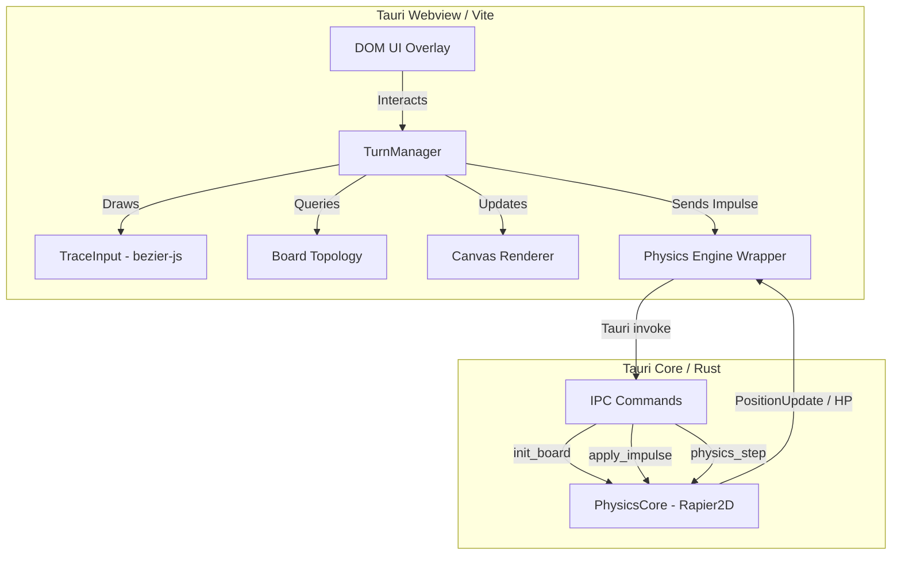
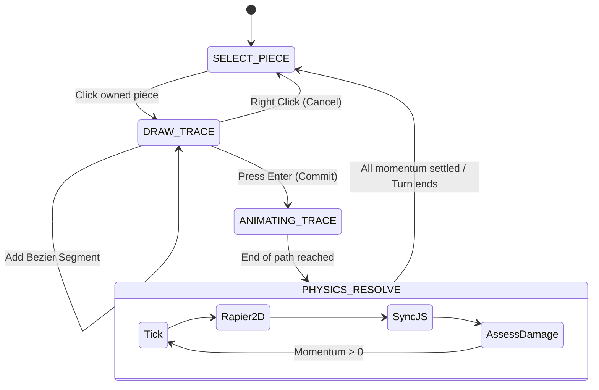

# Gocurvicnamics Architecture

## Overview
Gocurvicnamics is an asynchronous, kinetic trajectory-based strategy game built using a dual-layer architecture. It leverages a blazing-fast Rust backend for physics resolution and a modern, glassmorphic Vue/Vanilla frontend via Tauri v2 for rendering and input handling.

---

## 1. Directory Tree & Dependencies

```text
Gocurvicnamics/
├── architecture.md           # This document
├── package.json              # Frontend Node dependencies (Vite, bezier-js)
├── vite.config.js            # Vite bundler config
├── src/                      # Frontend Application (Vanilla JS / ES Modules)
│   ├── main.js               # Application Router & DOM overlay logic
│   ├── style.css             # Glassmorphic CSS variables and classes
│   ├── config/
│   │   └── defaults.js       # Constants for physics, padding, sizes
│   ├── db/
│   │   └── ReplayerDB.js     # Dexie wrapper for recording moves and metadata
│   └── engine/               # Core Frontend Engine
│       ├── Board.js          # Topology grid generation and boundary logic
│       ├── SetupManager.js   # Configuration loop & manual placement
│       ├── TraceInput.js     # Chained Cubic Bezier logic & Canvas events
│       ├── TurnManager.js    # State machine (Select -> Trace -> Resolve)
│       ├── Physics.js        # Tauri IPC wrapper for physics updates
│       ├── Piece.js          # Unit entity state
│       └── Renderer.js       # Centralized Canvas drawing
├── src-tauri/                # Backend Application (Rust)
│   ├── Cargo.toml            # Rust dependencies (tauri, rapier2d, serde)
│   └── src/
│       ├── main.rs           # Tauri command endpoints (IPC)
│       ├── state.rs          # AppState wrapping PhysicsCore in Mutex
│       ├── lib.rs            # Entry module
│       ├── ai/               # Ollama/Gemma local integration (pending)
│       └── physics/
│           └── mod.rs        # Rapier2D rigid body & collider simulation
└── tools/
    └── silice-indexer/       # Pre-commit AST analysis tool
        └── src/
            └── main.rs       # Tree-sitter ast-grep generator for codebase.json
```

---

## 2. System Architecture



### 2.1 Tauri v2 Desktop Shell
- **Role**: Provides the native desktop environment and inter-process communication (IPC) bridge.

### 2.2 Frontend Engine (Vanilla JS + Vite)
- **`main.js` (Router)**: Manages application state (`CONFIG`, `GAME`, `BINDU_PAUSE`, `INTEGRATION`).
- **`Board.js`**: Maintains logical grid configuration (Anchor Zones) and tracks piece existence.
- **`TurnManager.js`**: The core Game Loop. Implements a State Machine (`SELECT_PIECE` -> `DRAW_TRACE` -> `ANIMATING_TRACE` -> `PHYSICS_RESOLVE`).
- **`TraceInput.js`**: Handles multi-segment Bezier curve path drawing using `bezier-js`.
- **`SetupManager.js`**: Orchestrates initial board layout configuration and manual piece placement.
- **`Renderer.js`**: A centralized Canvas API renderer. Visualizes Board topologies, Traces, Pieces, and Health indicators.

### 2.3 Backend Physics Engine (Rust + Rapier2D)
- **`PhysicsCore` (`mod.rs`)**: Wraps Rapier2D to simulate elastic collisions, boundary bouncing, and kinetic momentum transfer.
- **IPC Commands (`main.rs`)**:
  - `init_board`: Receives board dimensions and piece data to initialize the simulation state, creating static walls around the board.
  - `apply_impulse`: Applies directional force to a piece based on its Bezier curve trajectory.
  - `physics_step`: Ticks the simulation forward and processes Narrow-phase contact graphs to deduce `HP` (Health Points) damage upon collision. Returns `PositionUpdate` payloads.

---

## 3. Interaction Flow & Turn Logic



1. **Setup**: The user configures the board grid exponentially ($N \times N$ layouts per player). `SetupManager` visualizes this.
2. **Placement**: Users place `BASE`, `DAMPENER`, `AMPLIFIER`, or `SLINGSHOT` pieces.
3. **Trace Phase**: `TurnManager` captures multi-segment cubic bezier paths via `TraceInput`.
4. **Animation**: The frontend smoothly animates the piece along the curve.
5. **Momentum Transfer**: At the end of the curve, residual momentum is sent via `apply_impulse` to the Rust Backend.
6. **Physics Resolve**: Rust ticks `physics_step`, colliding pieces against walls and each other, returning new coordinates and reduced `HP`.
7. **Scoring**: If a piece hits 0 `HP`, it disintegrates and increments the opposing player's score.

---

## 4. Tooling & Digital Twin
- **Silice Indexer**: A custom Rust-based tool (`tools/silice-indexer`) that parses the codebase via Tree-Sitter (`ast-grep`), generating `codebase.json`. This acts as a digital twin for the AI Protocol (`AI_PROTOCOL.md`) to maintain contextual awareness of the system's exports and structure across iterations.
