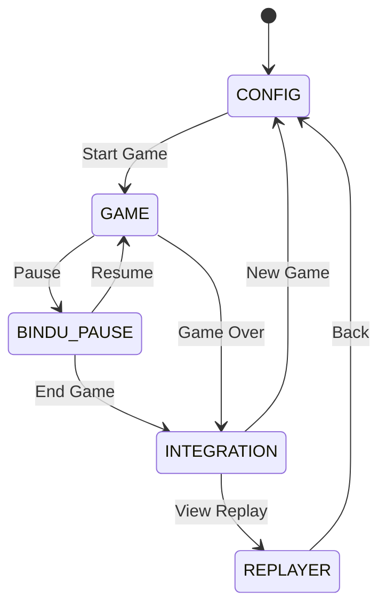
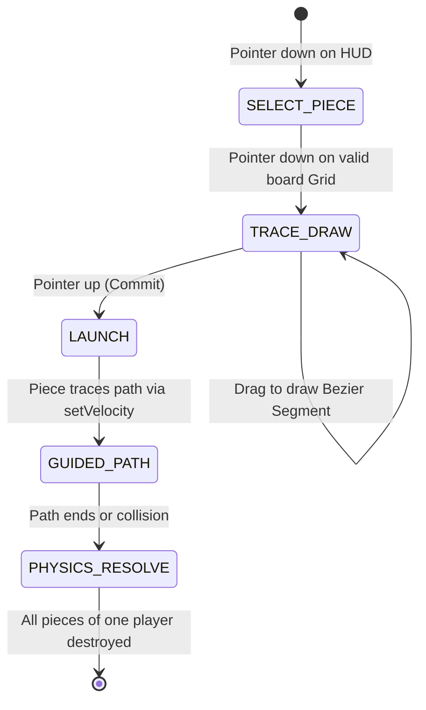
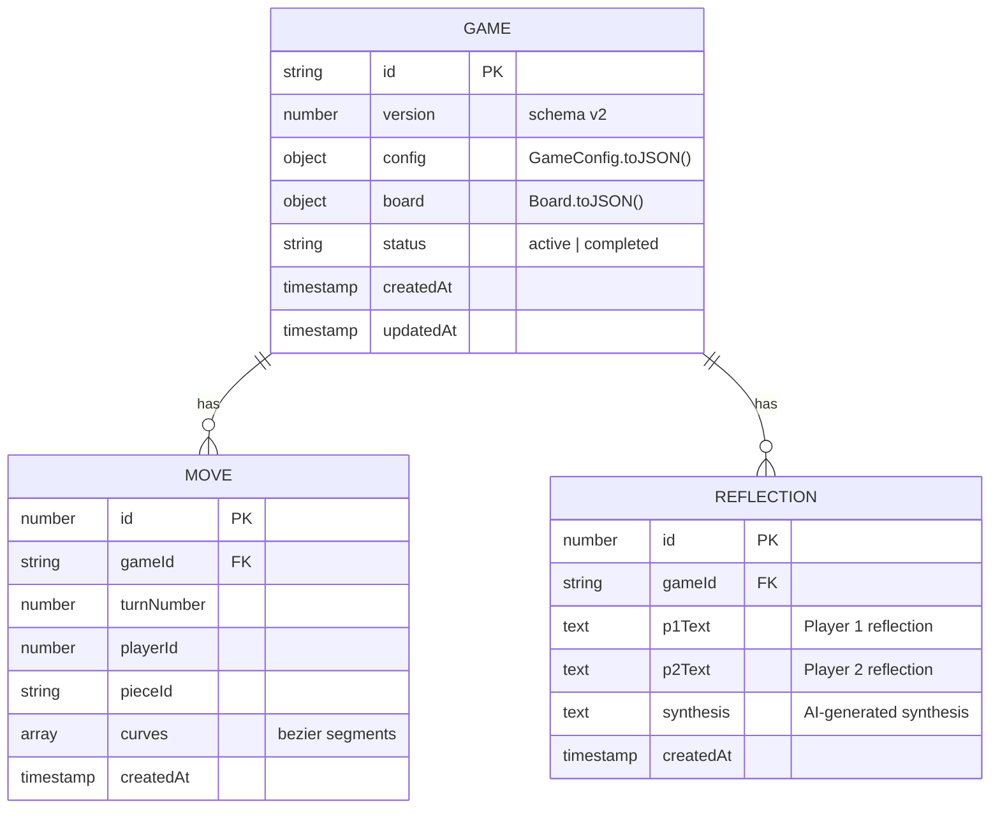
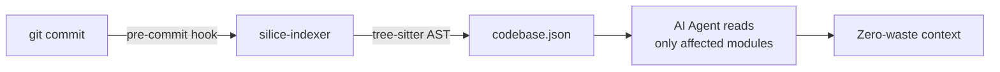

# Gocurvicnamics Architecture

## Overview

Gocurvicnamics is an asynchronous, kinetic trajectory-based strategy game built on an **atomic modular architecture** with a **dual-engine physics layer**. It uses a Vanilla JS frontend (Vite+bundled) for canvas rendering and input handling, with an optional Rust/Tauri backend for high-performance physics via Rapier2D. The entire codebase follows the **Silice V4 self-indexing protocol** for token-efficient AI-assisted development.

**Key architectural principles:**
- **Atomic Monolith** — every logical unit in its own file under `src/`
- **Dual Physics** — Matter.js (browser) or Rapier2D (Tauri), selected automatically at runtime
- **EventBus decoupling** — modules communicate via pub/sub, never direct references
- **Perpetual motion** — zero damping, restitution 1.0, pieces never stop until destroyed
- **Graceful degradation** — Tauri, Ollama, and DB failures are non-fatal warnings

---

## 1. Full Directory Tree (96 source files)

```
Gocurvicnamics/
├── silice/                                   # Silice V4 Protocol Metadata
│   ├── backlog.json                          # Task orchestration matrix (27 tasks)
│   ├── blueprint.md                          # Mermaid architecture maps
│   ├── codebase.json                         # Auto-generated AST digital twin
│   └── constitution.md                       # Immutable repo laws
│
├── src/                                      # FRONTEND — Vanilla JS / ES Modules
│   ├── main.js                               # Entry point: GameApp, canvas creation, boot
│   ├── style.css                             # Glassmorphic CSS variables & classes
│   │
│   ├── config/                               # Modular config (no magic numbers)
│   │   ├── BoardConfig.js                    # BOARD_DEFAULTS: 1400x800, 5x5 grid, 60px cell
│   │   ├── GameplayConfig.js                 # scorePerKill: 100, maxPiecesPerZone: 10
│   │   ├── PhysicsConfig.js                  # restitution: 1.0, damping: 0, impulseScale
│   │   ├── PieceConfig.js                    # PIECE_SPECS: mass/hp/radius per type
│   │   ├── UIConfig.js                       # Glass opacity, fonts, control sizes
│   │   └── defaults.js                       # Composite default export
│   │
│   ├── core/                                 # Core infrastructure
│   │   ├── AppLifecycle.js                   # Lifecycle manager with cleanup registry
│   │   ├── Constants.js                      # SCREENS, TURN_STATES, EVENTS (17 event types)
│   │   ├── EventBus.js                       # Pub/sub singleton (on/once/off/emit/clear)
│   │   ├── GameConfig.js                     # Aggregates board+pieces+physics configs
│   │   ├── GameState.js                      # Singleton: gameId, stats, moves, config
│   │   └── ScreenRouter.js                   # Registers + navigates 5 screens
│   │
│   ├── engine/                               # Core game engine
│   │   ├── GameLoop.js                       # requestAnimationFrame wrapper
│   │   ├── SetupManager.js                   # Board layout + manual piece placement
│   │   ├── TurnManager.js                    # Legacy state machine (for async turn-based play)
│   │   ├── ActionManager.js                  # Real-Time state machine & Pointer ID tracker
│   │   │
│   │   ├── animation/                        # Visual animation subsystem
│   │   │   ├── AnimationController.js        # Orchestrates trace→position animation
│   │   │   ├── CurveAnimator.js              # Bezier curve interpolation + end-vector
│   │   │   └── GhostTrailRenderer.js         # Semi-transparent trail behind animated piece
│   │   │
│   │   ├── board/                            # Board topology
│   │   │   ├── Board.js                      # Pieces Map, zone generation, destroyed cleanup
│   │   │   ├── GridUtils.js                  # Grid-to-pixel coordinate conversion
│   │   │   ├── PlacementValidator.js          # Validates piece placement in zones
│   │   │   ├── Zone.js                       # Anchor zone entity (player, rect, cells)
│   │   │   └── ZoneGenerator.js              # Generates zones from layout config
│   │   │
│   │   ├── collision/                        # Damage resolution chain
│   │   │   ├── CollisionDetector.js          # Static helpers: areAdversaries, relVelocity
│   │   │   ├── DamageResolver.js             # Calls piece.onCollision() for type-specific dmg
│   │   │   └── ShockwaveGenerator.js         # Radial push effect (Amplifier explosion)
│   │   │
│   │   ├── physics/                          # Dual-engine physics adapter
│   │   │   ├── PhysicsAdapter.js             # Abstract base class (step, impulse, teleport)
│   │   │   ├── PhysicsMatter.js              # Matter.js implementation (browser path)
│   │   │   ├── PhysicsTauri.js               # Tauri IPC wrapper (Rapier2D backend)
│   │   │   └── PhysicsSync.js                # Factory: auto-selects engine at runtime
│   │   │
│   │   ├── pieces/                           # Piece type hierarchy
│   │   │   ├── Piece.js                      # Base entity: id, hp, position, takeDamage()
│   │   │   ├── PieceFactory.js               # Creates piece instances by type string
│   │   │   ├── PieceTypeRegistry.js           # Maps type → specs (mass, hp, radius, color)
│   │   │   ├── BasePiece.js                  # Standard: onCollision → 1 dmg if relVel>5
│   │   │   ├── DampenerPiece.js              # Heavy: onCollision → 1 dmg if relVel>8
│   │   │   ├── AmplifierPiece.js             # Suicide: deals HP as dmg + shockwave
│   │   │   ├── SlingshotPiece.js             # Kinetic: damage × curveLengthMultiplier
│   │   │   ├── GravitonPiece.js              # Anchor: High mass, absorbs heavy hits
│   │   │   └── PhantomPiece.js               # Phase: 0 damage if relVel>10.0
│   │   │
│   │   ├── render/                           # Canvas rendering (single context)
│   │   │   ├── Renderer.js                   # Central orchestrator: calls sub-renderers
│   │   │   ├── BoardRenderer.js              # Grid, zones, void expanse, walls
│   │   │   ├── PieceRenderer.js              # Circles, HP bars, glow effects
│   │   │   ├── TraceRenderer.js              # Bezier curves, control points, handles
│   │   │   ├── EffectsRenderer.js            # Shockwave rings, ghost trails, particles
│   │   │   └── HUDCanvasRenderer.js          # Turn indicator, scores, timers
│   │   │
│   │   ├── scoring/                          # Score tracking
│   │   │   ├── ScoreBoard.js                 # Visual score display (DOM overlay)
│   │   │   └── ScoreManager.js               # Score logic: kills, damage dealt, stats
│   │   │
│   │   └── trace/                            # Bezier trace input
│   │       ├── TraceInput.js                 # Mouse events: 3-click segment drawing
│   │       ├── TraceController.js            # Multi-segment state machine
│   │       ├── TraceSegment.js               # Single cubic bezier segment entity
│   │       └── TraceValidator.js             # Validates trace bounds & intersection
│   │
│   ├── db/                                   # IndexedDB persistence
│   │   ├── ReplayEngine.js                   # Replay playback (speed control, progress)
│   │   ├── ReplayerDB.js                     # Dexie wrapper (version 2, 3 tables)
│   │   ├── schema/                           # Table schemas
│   │   │   ├── GameSchema.js                 # Game metadata
│   │   │   ├── MoveSchema.js                 # Per-turn trace data
│   │   │   └── ReflectionSchema.js           # Post-game AI synthesis
│   │   └── repositories/                     # Data access layer
│   │       ├── GameRepository.js             # CRUD for games table
│   │       ├── MoveRepository.js             # CRUD for moves table
│   │       └── ReflectionRepository.js       # CRUD for reflections table
│   │
│   ├── ai/                                   # AI integration (Ollama)
│   │   ├── AIClient.js                       # Abstract AI client interface
│   │   ├── OllamaClient.js                   # HTTP client for local Ollama API
│   │   ├── PromptTemplates.js                # Reflection prompt templates
│   │   └── SynthesisEngine.js                # Post-game synthesis orchestration
│   │
│   ├── ui/                                   # Screen overlays
│   │   ├── ConfigScreen.js                   # Board size, piece count, player toggle
│   │   ├── GameHUD.js                        # In-game HUD (score, turn, timers)
│   │   ├── BinduPauseScreen.js               # Pause/mindfulness break overlay
│   │   ├── IntegrationRoom.js                # Post-game: stats + AI reflection
│   │   └── ReplayerScreen.js                 # Match replay viewer
│   │
│       ├── ui/ui-utils/                          # Reusable UI components
│   │   ├── ButtonGroup.js                    # Styled button groups
│   │   ├── GlassPanel.js                     # Glassmorphism panel component
│   │   ├── SliderControl.js                  # Config sliders
│   │   └── TextArea.js                       # Styled text areas
│   │
│   └── utils/                                # General utilities
│       ├── AsyncLock.js                      # Mutex-like async lock
│       ├── ColorUtils.js                     # Color manipulation helpers
│       ├── DOMUtils.js                       # DOM element creation helpers
│       ├── IPCDetector.js                    # Detects Tauri IPC availability
│       ├── Logger.js                         # Scoped logger (info, warn, debug, error)
│       └── MathUtils.js                      # distance, clamp, lerp, vector ops
│
├── src-tauri/                                # BACKEND — Rust + Tauri
│   ├── Cargo.toml                            # Dependencies: tauri 2.11, rapier2d 0.26, serde
│   └── src/
│       ├── main.rs                           # Tauri command endpoints (7 commands)
│       ├── lib.rs                            # Library entry (run() for tests)
│       ├── state.rs                          # AppState: Mutex<PhysicsCore>
│       │
│       ├── physics/                          # Rapier2D simulation
│       │   ├── mod.rs                        # Module declarations
│       │   ├── core.rs                       # PhysicsCore struct (owns all Rapier2D sets)
│       │   ├── collision.rs                  # Step pipeline + Started events + velocity threshold
│       │   ├── config.rs                     # Constants (restitution, damping, damage, velocity)
│       │   ├── impulse.rs                    # apply_impulse() + teleport_piece()
│       │   ├── piece.rs                      # add_piece() with CCD + bit-packed user_data
│       │   ├── types.rs                      # PieceData, PositionUpdate, PieceType enum
│       │   └── walls.rs                      # 4 static cuboid walls
│       │
│       ├── commands/                         # IPC command dispatchers
│       │   ├── mod.rs                        # Module declarations
│       │   ├── board.rs                      # init_board
│       │   ├── physics.rs                    # physics_step, apply_impulse, teleport, remove
│       │   └── ai.rs                         # synthesize_reflections
│       │
│       └── ai/                               # Rust-side AI
│           ├── mod.rs                        # generate_synthesis entry
│           ├── client.rs                     # HTTP client for Ollama API
│           └── prompts.rs                    # Spanish synthesis prompt builder
│
├── tools/
│   └── silice-indexer/                       # Rust AST Indexer (tree-sitter)
│       ├── Cargo.toml
│       └── src/
│           ├── main.rs                       # Entry: calls run_indexer()
│           ├── config.rs                     # Excluded dirs, output path
│           ├── indexer.rs                    # Directory walk + file processing
│           ├── parser.rs                     # Language detection + symbol extraction
│           └── serializer.rs                 # CodebaseJson struct + JSON output
│
├── package.json                              # pnpm, ES modules, Vite 5
├── vite.config.js                            # Vite config (port 3000, dist/)
├── index.html                                # App shell
├── README.md                                 # This file
└── architecture.md                           # You are here
```

---

## 2. System Architecture

### 2.1 Dual-Engine Physics

```mermaid
graph TD
    subgraph TurnManager_ [TurnManager]
        TM[TurnManager]
        DR[DamageResolver]
        SW[ShockwaveGenerator]
    end

    subgraph PhysicsSync_ [PhysicsSync.create(board)]
        PS{IPCDetector}
        MAT[PhysicsMatter<br/>Matter.js]
        TAU[PhysicsTauri<br/>IPC Wrapper]
    end

    subgraph Rust_ [Tauri Backend — Rust]
        IPC[IPC Commands]
        RC[PhysicsCore<br/>Rapier2D]
        COL[collision.rs<br/>resolve_collision]
    end

    TM --> PS
    PS -->|Tauri available| TAU
    PS -->|browser only| MAT

    MAT -->|Engine.update| COL_MAT[collisionStart events]
    COL_MAT -->|collision pairs| MAT_QUEUE[collisionQueue]
    MAT_QUEUE -->|_resolveCollisions| DR
    DR -->|onCollision per type| MAT
    DR -->|shockwave: true| SW

    TAU -->|invoke physics_step| IPC
    IPC -->|physics_pipeline.step| RC
    RC -->|CollisionEvent::Started| COL
    COL -->|relativeVelocity check| COL
    COL -->|PositionUpdate + HP| TAU
    TAU -->|update piece positions| TM

    TM -->|removeDestroyedPieces| RM[Board.removeDestroyed]
    RM -->|physics.removePiece| MAT
    RM -->|physics.removePiece| TAU
```

### 2.2 Engine Selection (`PhysicsSync.js`)

Priority order:
1. `FORCE_ENGINE` env var (`matter` / `tauri`) — override for testing
2. `IPCDetector.isTauriAvailable()` — probes for `window.__TAURI__`
3. **Fallback** → `PhysicsMatter` (pure JS, browser-compatible)

Both engines expose the same `PhysicsAdapter` interface:

```js
interface PhysicsAdapter {
  initialize()           → boolean
  syncFromBoard()        → void
  step()                 → boolean (movement detected)
  applyImpulse(id,dx,dy,mag) → void
  teleportPiece(id,x,y)  → void
  removePiece(id)        → void
  setCollisionResolver(resolver, shockwaveGen) → void
}
```

### 2.3 Collision Resolution Chain

```
collisionStart (Matter.js) / CollisionEvent::Started (Rapier2D)
       │
       ▼
  Are both pieces alive? Are they adversaries?  ───NO──→ skip
       │
      YES
       │
       ▼
  relativeVelocity > threshold?   ───NO──→ skip
  ┌─────┬──────────┬─────────────┐
  │Base │Dampener  │Amplifier    │Slingshot
  │ >5  │ >8       │ >1          │ >3
  └─────┴──────────┴─────────────┘
       │
      YES
       │
       ▼
  DamageResolver.resolve(pieceA, pieceB, relVel)
       │
       ├──→ pieceA.onCollision(pieceB, relVel) → collA
       ├──→ pieceB.onCollision(pieceA, relVel) → collB
       │
       ├──→ pieceA.takeDamage(collB.damage)
       ├──→ pieceB.takeDamage(collA.damage)
       │
       └──→ collA.shockwave || collB.shockwave
                  │
                  ▼
            ShockwaveGenerator.emit(x,y,radius,force)
                  │
                  ▼
            Radial push on all nearby pieces
                  │
                  ▼
            HP <= 0? ──→ piece.destroyed = true
                  │
                  ▼
            Next physics tick:
            board.removeDestroyedPieces()
            physics.removePiece(id)
            scoreManager.onPieceDestroyed(killer)
```

### 2.4 Bit-Packing (Rapier2D)

HP, player ID, and curvature are packed into the collider's `u128` `user_data`:

```
bits:  127 ... 96 | 95 ... 64 | 63 ... 32 | 31 ... 0
        (unused)    curvature    player_id      hp (f32 as u32)
```

- `curvature = f32::from_bits((d1 >> 64) as u32)` — bits 64-95
- `player1 = (d1 >> 32) as u8` — bits 32-63
- `hp1 = (d1 & 0xFFFFFFFF) as f32` — lower 32 bits
- Wall colliders have no `user_data` (default 0) → player_id=0 → filtered

### 2.5 Dynamic Open Curves (Magnus Effect)

The physics engine supports a dynamic Magnus effect that operates identically in both Matter.js and Rapier2D backends:
1. **Trace Inheritance:** When a piece finishes following a drawn bezier path, the difference between the starting and ending angles of the trace is injected into the piece as `angularVelocity` (spin).
2. **Magnus Deflection:** During free flight, the piece's velocity vector is rotated (Matter.js) or pushed (Rapier2D) proportionally to its `angularVelocity` multiplied by its `curvature` trait coefficient.
3. **Decay:** `angularVelocity` decays exponentially (`spin * 0.98`) per tick. This guarantees that pieces trace **open curves** (spirals that straighten out) rather than infinite closed circles.
4. **Collision Spin:** Elastic collisions against walls or other pieces naturally impart `angularVelocity` due to friction, causing the piece to organically bend its trajectory after a bounce.

---

## 3. State Machines

### 3.1 Screen Router



**Registered in `main.js`** via `ScreenRouter.register(name, factory)`:
- `CONFIG` → `ConfigScreen` — board layout, piece count, player toggle
- `GAME` → `TurnManager` + `GameHUD` — main game loop
- `BINDU_PAUSE` → `BinduPauseScreen` — mindfulness pause overlay
- `INTEGRATION` → `IntegrationRoom` — post-game stats + AI reflections
- `REPLAYER` → `ReplayerScreen` — match replay via `ReplayEngine`

### 3.2 Action & Turn Management



The game operates primarily in a real-time hot-seat model managed by `ActionManager.js`:
- **Pointer ID Tracking**: Multi-touch and multi-cursor support is achieved by mapping `pointerId`s to specific teams when interacting with the HUD. This allows true simultaneous play without global turn blocking.
- **Strict Grid Constraints**: The `PlacementValidator` ensures pieces can only be spawned mathematically centered on their respective colored Anchor Zones.
- **Guided Missile Physics**: During `GUIDED_PATH`, the `PhysicsMatter` adapter steers the piece by continuously updating its velocity towards the drawn curve's target points, allowing it to seamlessly collide with obstacles via continuous collision detection.

*(The legacy `TurnManager.js` handles strictly asynchronous state transitions when required by specific game modes.)*

The physics loop runs continuously at `PHYSICS_TICK_INTERVAL = 50ms` regardless of input state. Between actions, pieces already in motion continue bouncing and colliding indefinitely.

---

## 4. Database Schema (Dexie.js / IndexedDB)



---

## 5. Physics Configuration (Shared Constants)

Both engines read from `PhysicsConfig.js` (JS) and `config.rs` (Rust). Values are kept identical:

| Constant | JS | Rust | Purpose |
|----------|----|------|---------|
| `gravity` | `{x:0, y:0}` | `vector![0,0]` | Top-down 2D, no gravity |
| `restitution` | `1.0` | `1.0` | Perfect elastic bounce |
| `friction` | `0.0` | `0.0` | No surface friction |
| `linearDamping` | `0.0` (frictionAir) | `0.0` | Perpetual motion |
| `damagePerCollision` | `1.0` | `1.0` | Flat HP damage per hit |
| `minImpactForDamage` | `5.0` | `5.0` | Velocity threshold |
| `impulseScale` | `0.0005` | N/A (applied in JS) | Calibration factor |
| `impulseBaseMagnitude` | `5000.0` | N/A | Base launch force |
| `wallThickness` | `50` | `50.0` | Boundary wall size |

---

## 6. IPC Commands (Tauri)

| Command | Direction | Payload | Response |
|---------|-----------|---------|----------|
| `ping` | JS → Rust | — | `bool` |
| `init_board` | JS → Rust | `width`, `height`, `pieces: Vec<PieceData>` | — |
| `physics_step` | JS → Rust | — | `Vec<PositionUpdate>` |
| `apply_impulse` | JS → Rust | `pieceId`, `fx`, `fy` | — |
| `teleport_piece` | JS → Rust | `pieceId`, `x`, `y` | — |
| `set_spin` | JS → Rust | `pieceId`, `spin` | — |
| `remove_piece` | JS → Rust | `pieceId` | — |
| `synthesize_reflections` | JS → Rust | `p1Text`, `p2Text` | `Result<String, String>` |

---

## 7. Events (EventBus)

17 event types in `Constants.js` (`GAME_EVENTS`):

| Event | Payload | Emitter |
|-------|---------|---------|
| `SCORE_CHANGED` | `{ scores }` | ScoreManager |
| `TURN_CHANGED` | `{ playerId }` | TurnManager |
| `PIECE_DESTROYED` | `{ piece, killer }` | TurnManager |
| `PIECE_DAMAGED` | `{ piece, damage }` | DamageResolver |
| `COLLISION` | `{ pieceA, pieceB, relVel }` | DamageResolver |
| `SHOCKWAVE` | `{ x, y, radius, force }` | ShockwaveGenerator |
| `PHYSICS_STEP` | `{ movement }` | PhysicsAdapter |
| `PHYSICS_SETTLED` | `{}` | TurnManager |
| `TRACE_CONFIRMED` | `{ curves }` | TraceInput |
| `TRACE_CANCELLED` | `{}` | TraceInput |
| `TRACE_SEGMENT_ADDED` | `{ segment }` | TraceInput |
| `GAME_STARTED` | `{ config }` | SetupManager |
| `GAME_ENDED` | `{ winner, stats }` | TurnManager |
| `DB_SAVED` | `{ table, id }` | ReplayerDB |
| `AI_SYNTHESIS` | `{ text, error? }` | SynthesisEngine |
| `REPLAY_STARTED` | `{ gameId }` | ReplayEngine |
| `REPLAY_ENDED` | `{}` | ReplayEngine |

---

## 8. Silice Protocol Integration

The project auto-indexes itself via the Rust-based `tools/silice-indexer`:



**`silice/` directory:**
- **`constitution.md`** — Immutable laws: no servers, graceful degradation, pure engine modules, config-first, agent operational limits
- **`blueprint.md`** — Mermaid architecture diagrams matching this document
- **`backlog.json`** — 27 tasks across 3 phases, all `verified`
- **`codebase.json`** — Auto-generated on commit (never edited manually). Contains AST-extracted function signatures, file classifications, and exports for every file (81 entries current).

The indexer (`tools/silice-indexer/src/`) is split into 5 atomic files:
- `main.rs` — Entry point
- `config.rs` — Exclusion rules, output path
- `indexer.rs` — Recursive directory walk with `ignore::Walk` + file processing
- `parser.rs` — Language detection (14+ languages) + symbol extraction via `ast-grep`
- `serializer.rs` — `CodebaseJson` struct + pretty-print JSON serialization
