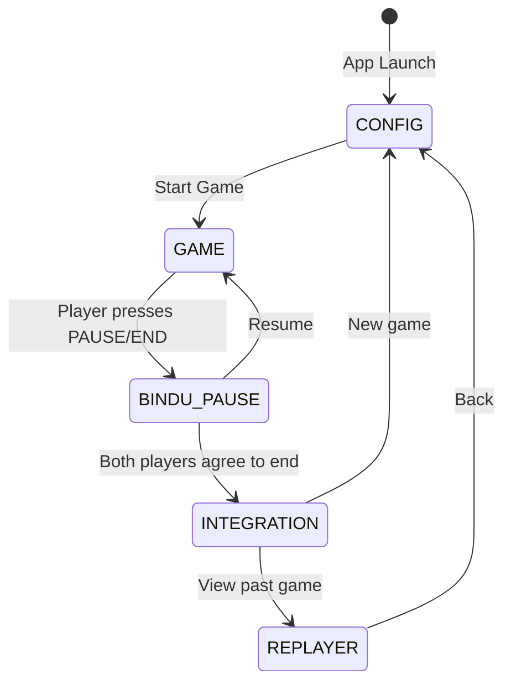
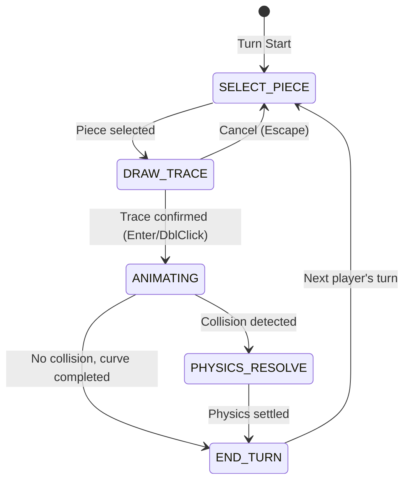
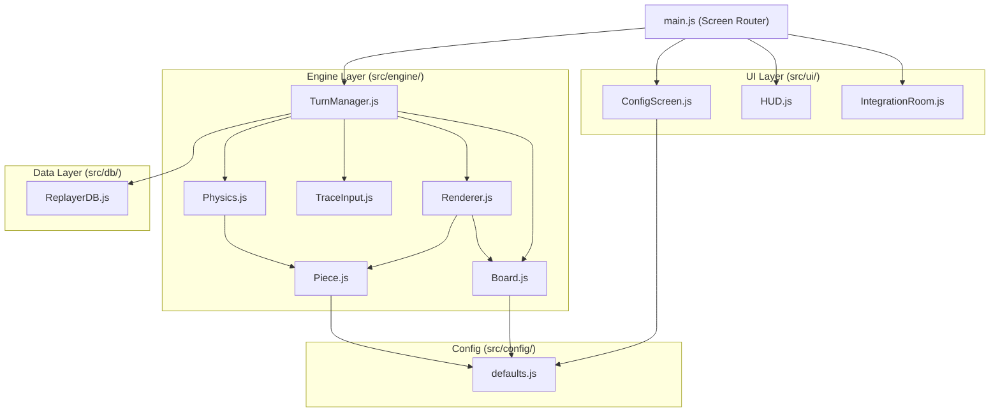
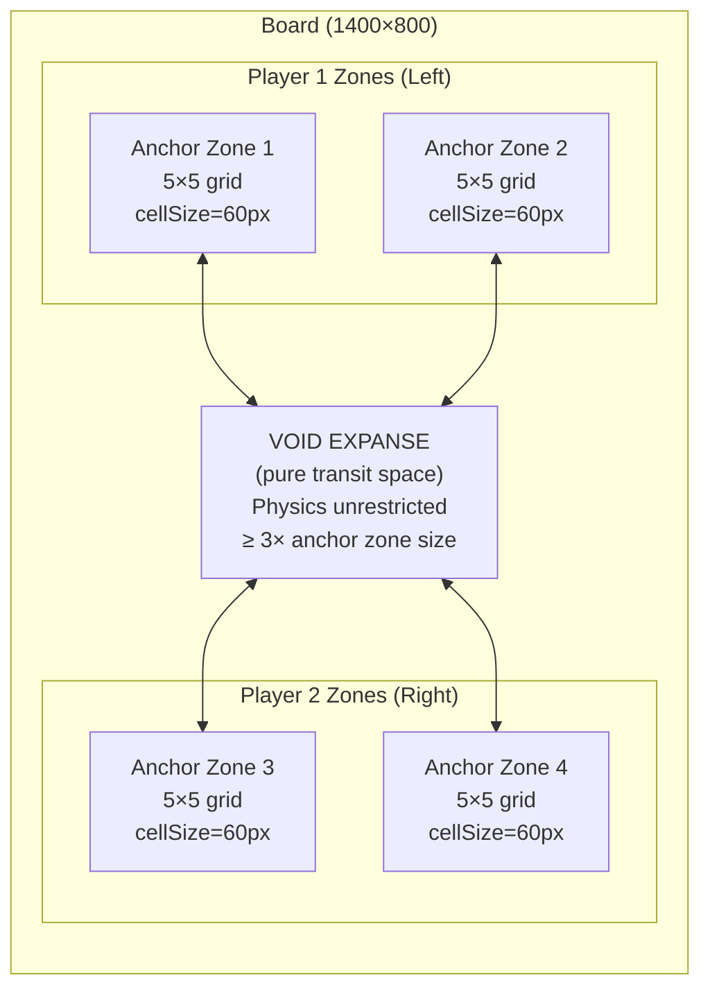
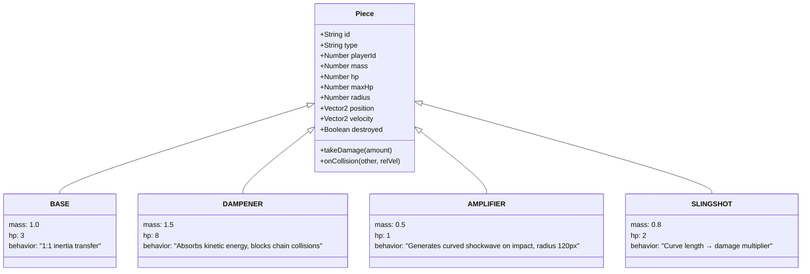
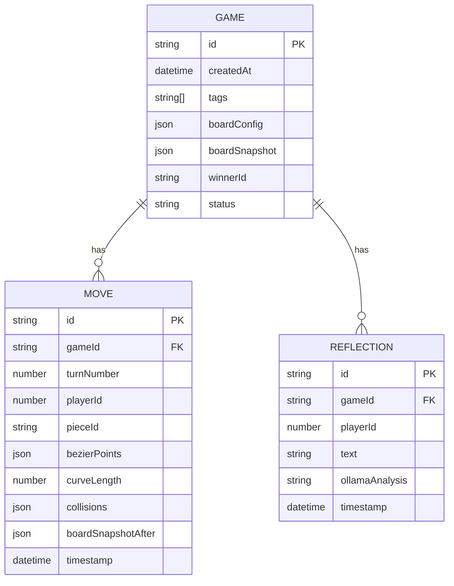
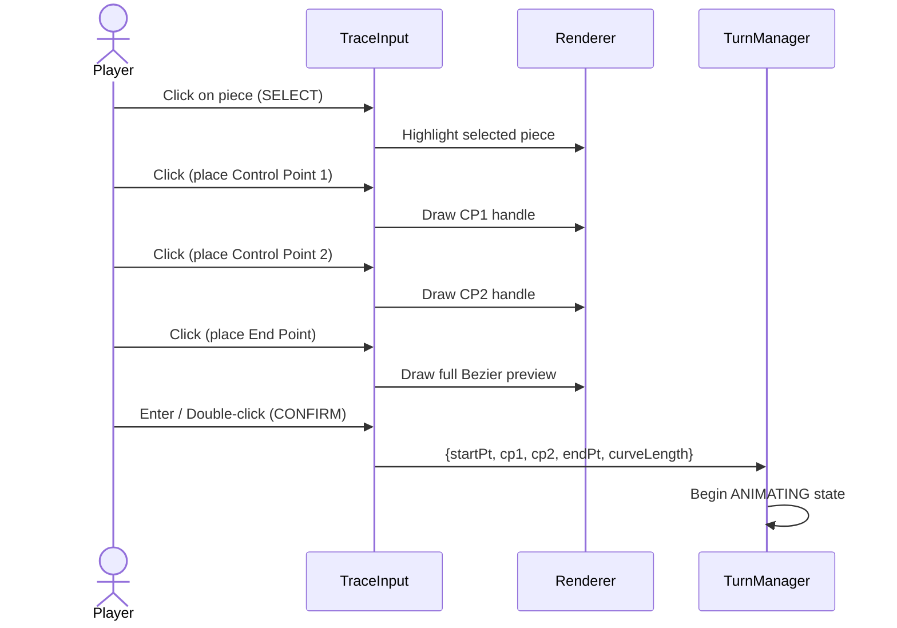

# Blueprint — Gocurvicnamics Architecture

> Silice Protocol V4 · Updated: Phase 0-1 Complete

---

## Game State Machine

---

## Turn State Machine

---

## Module Architecture

---

## Board Topology

---

## Piece Type System

---

## Data Schema (ReplayerDB)

---

## Bezier Trace Input Flow

